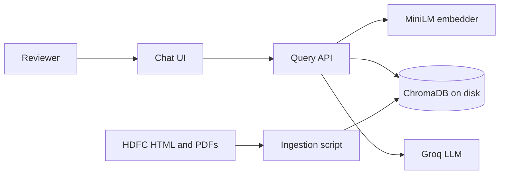
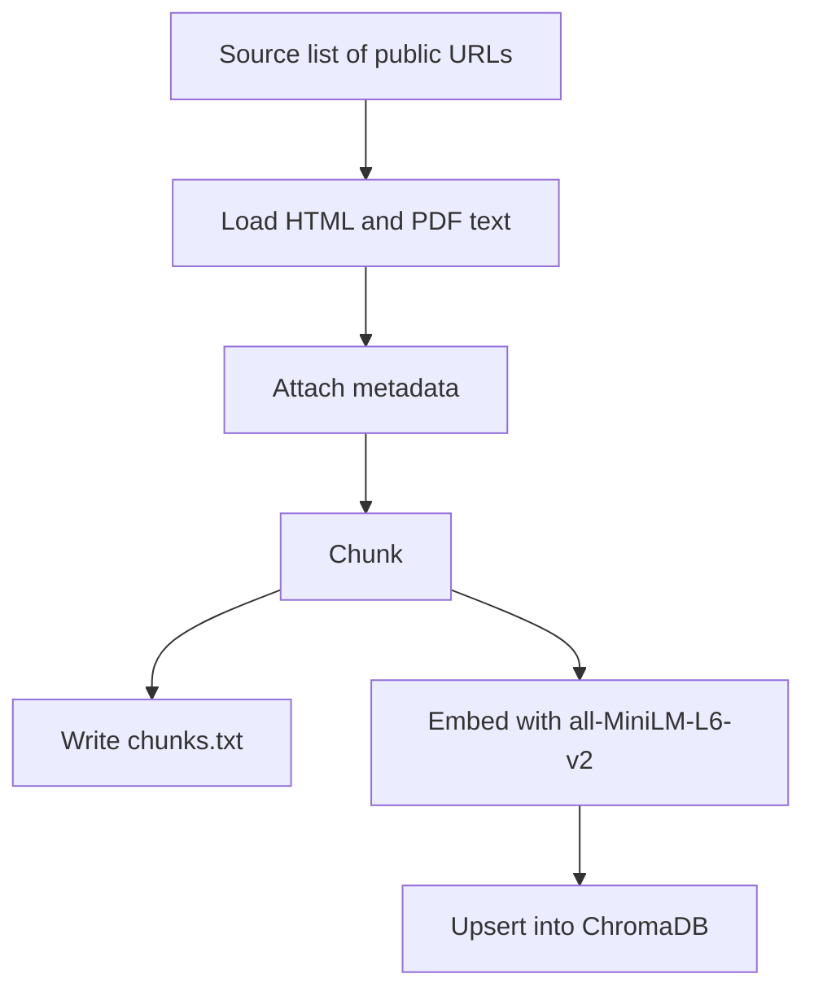
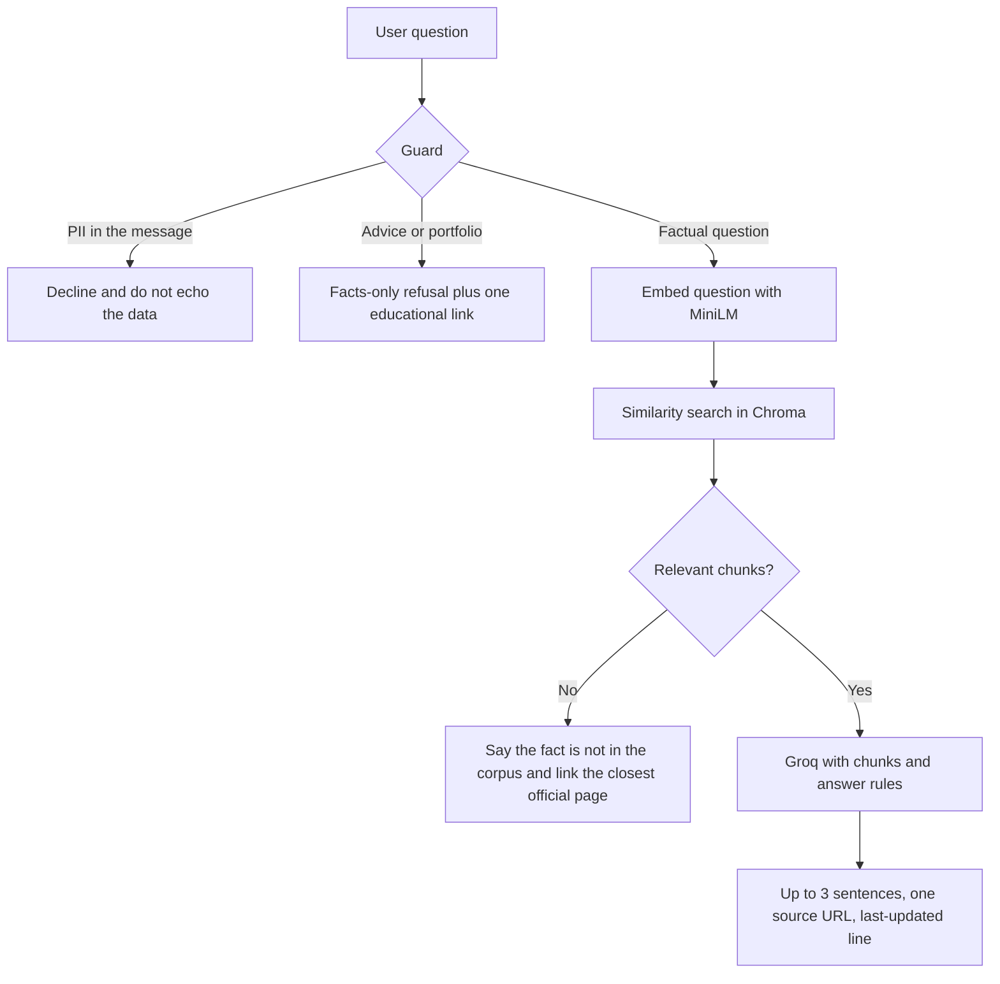

# Architecture

## Mutual Fund FAQ Assistant

This document describes how the prototype in `docs/PRD.md` is built. The system is a two-stage RAG chatbot: documents are ingested once, and every question is answered from retrieved chunks.

## 1. System context

A reviewer opens a small web UI, asks a factual question about one of five HDFC schemes, and gets a short answer with one official source link. The language model never sees the full corpus. It sees only the chunks retrieved for that question, plus the answer rules (facts only, no advice, at most three sentences).

There is no user account, no database of people, and no path that stores PAN, Aadhaar, account numbers, OTPs, email, or phone numbers.

## 2. Stages

RAG is split into two stages that do not run together.

| Stage | When it runs | Pipeline |
|---|---|---|
| Ingestion | Once, or again only when sources change | Load → Chunk → Embed → Store |
| Retrieval and answer | Every user question | Question → Embed → Retrieve → LLM → Answer |

The query process reads the persisted Chroma collection. It does not fetch pages or re-embed the corpus on startup.

## 3. Ingestion

### Load

- Input is the URL table in the PRD (HDFC Large Cap, Flexi Cap, ELSS Tax Saver, Mid Cap, Small Cap).
- HTML pages are fetched and reduced to visible text.
- Fund-facts PDFs are parsed to text.
- Each document keeps `source_url`, `scheme`, `plan` (direct, regular, or unknown), and `doc_title`.
- A URL that fails or yields no text is skipped. The skip reason is written to the source list so the README can explain it.

### Chunk

Chunk size and overlap are chosen after the loaded text is inspected, then recorded in the README. The architecture fixes the shape of a chunk, not the numbers, until that inspection:

- One chunk is a contiguous slice of a single source document.
- Overlap is small enough to keep a fact (a ratio, a load, a lock-in) from being cut in half, and small enough that neighboring chunks stay distinguishable.
- Each chunk stores: `source_url`, `scheme`, `plan`, `doc_title`, `chunk_index`.
- Every chunk is also written to a readable `chunks.txt` for review. That file is an inspection artifact. Retrieval reads Chroma, not the text file.

### Embed and store

- Model: `sentence-transformers/all-MiniLM-L6-v2`.
- Runs locally. No embedding API key.
- Vector size: 384.
- Store: one Chroma collection on disk (for example `data/chroma/`).
- Re-running ingestion replaces the collection so stale chunks from a dropped URL do not remain.

## 4. Query

### Guard

Runs before retrieval so the model is not asked to advise or to handle personal data.

- Personal identifiers: reply that the assistant does not take that information, and do not repeat the value.
- Buy, sell, suitability, or portfolio questions: polite refusal, no recommendation, one educational link already in the corpus or a scoped SEBI/AMFI education page.
- Returns or performance comparisons: do not calculate. Point to the official factsheet URL from metadata.

### Retrieve

- Embed the question with the same MiniLM model used at ingestion.
- Query Chroma for the top chunks (a small k, set in config, typically 4).
- Pass chunk text and `source_url` into the prompt. The citation in the answer must be one of those URLs.

### Generate

- Provider: Groq. Model name is a config value. The API key is read from `GROQ_API_KEY` in `.env`.
- The prompt states: answer only from the supplied chunks; if the fact is absent, say so; maximum three sentences; include exactly one source link; append `Last updated from sources: <ingestion date>`.
- The ingestion date is stored beside the Chroma directory when ingestion finishes. The UI does not invent a date.

## 5. Components

| Component | Responsibility |
|---|---|
| `ingest` | Load, chunk, write `chunks.txt`, embed, persist Chroma, record the source list and ingestion date. |
| `retrieve` | Embed a question and return top chunks with metadata. |
| `answer` | Apply guards, call Groq, enforce citation and length rules on the response. |
| `app` | Tiny UI: welcome line, three example questions, disclaimer, input, answer with link. |
| `data/` | Persisted Chroma, `chunks.txt`, source list, ingestion date. Gitignored if large; the source list and chunk dump are submitted with the demo. |

The UI talks only to the query path. It does not embed documents and it does not hold the Groq key. The key stays on the server process that calls Groq.

## 6. Data kept on disk

| Artifact | Contents |
|---|---|
| Chroma directory | 384-d vectors, chunk text, metadata |
| `chunks.txt` | Human-readable chunks with the same metadata |
| Source list (CSV or Markdown) | URLs kept, URLs dropped, and why |
| Ingestion date | Value printed as “Last updated from sources” |

Nothing in these files is personal data. Logs must not record API keys or anything the guard classified as PII.

## 7. Request path

1. The UI sends the question text to the query endpoint.
2. The guard classifies the question.
3. For a factual question, retrieval returns chunks.
4. Groq writes the draft answer from those chunks.
5. The response to the UI is the answer text, one URL, and the last-updated line.
6. The disclaimer “Facts-only. No investment advice.” stays visible on the page for every turn.

## 8. Configuration

| Setting | Source |
|---|---|
| `GROQ_API_KEY` | `.env`, never committed |
| Embedding model name | Code constant: `sentence-transformers/all-MiniLM-L6-v2` |
| Chroma path | Config, default under `data/chroma` |
| Top-k | Config |
| Chunk size and overlap | Chosen after inspection, documented in the README |
| Corpus URLs | PRD source table, copied into the ingestion source list |

## 9. Failure behavior

| Condition | Behavior |
|---|---|
| Page or PDF cannot be loaded | Skip it, record the reason, continue ingestion. |
| Chroma directory missing at query time | Tell the operator to run ingestion. Do not embed on the query path. |
| No chunk is relevant | Do not invent a number. Say it is not in the sources and link the nearest official page in metadata. |
| Groq request fails | Show a short error. Do not fall back to an answer without a citation. |
| User sends personal data | Decline and do not store the message body. |

## 10. What this architecture deliberately leaves out

- A second vector database, a reranker, or an agent that browses the live web at question time.
- Return math, scheme ranking, or advice prompts.
- Accounts, session history stored on the server, or any PII table.
- Re-ingestion on every application restart.
